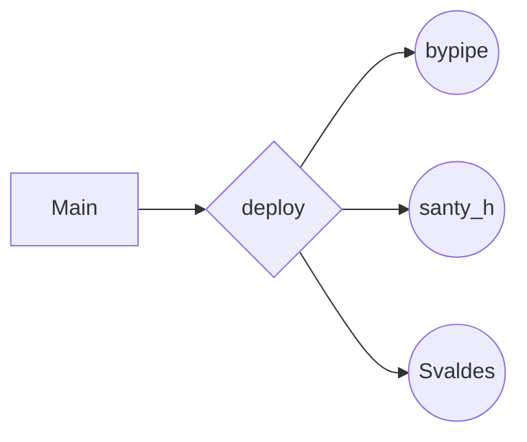
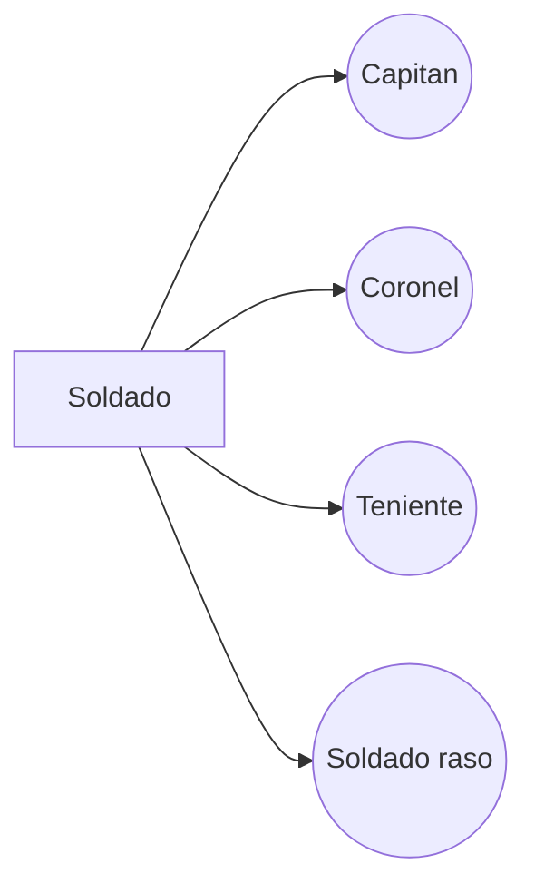

*MINIPROYECTO PROGRAMACION ORIENTADA A EVENTOS* 

*INTEGRANTES:*

 - Santiago Hernandez Aguado - *2380367*
 - Felipe Ortiz Calan - *2380642*
 - Samuel Alberto Valdes Gomez  - *2380346*

**lenguaje:** ***Java***

**Modo de trabajo:**
trabajamos cada uno en nuestra rama, las cuales estan desprendidas de la Rama "deploy" que a su vez es una rama del Main, utilizamos tambien una herramienta llamada *live share* para poder trabajar todos en tiempo real.

Trabajamos de las ramas personales (bypipe, Svaldes, santy_h) a deploy, en esta rama estan todos los commits y PR's. En el main solo subimos la totalidad del miniproyecto II y un error de un PR que deberia ir a deploy.

 
**Ramas utilizadas**

**Esquema de las clases:**

