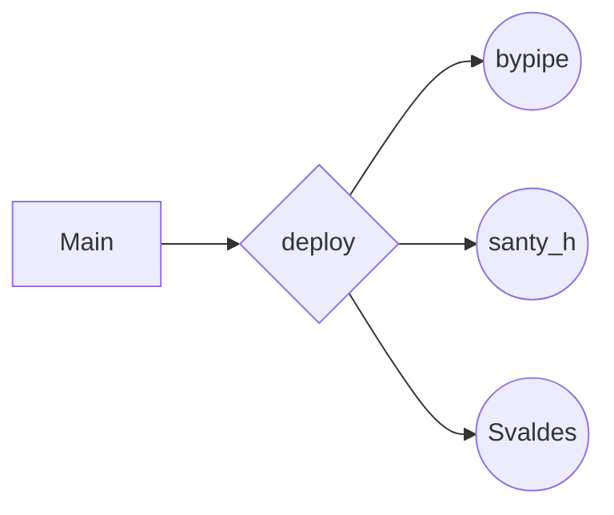
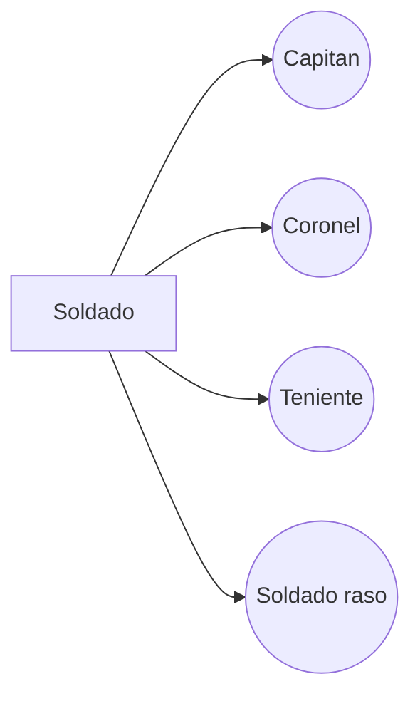

*MINIPROYECTO PROGRAMACION ORIENTADA A EVENTOS* 

*INTEGRANTES:*

 - Santiago Hernandez Aguado - *2380367*
 - Felipe Ortiz Calan - *2380642*
 - Samuel Alberto Valdes Gomez  - *2380346*

**Modo de trabajo:**
trabajamos cada uno en nuestra rama, las cuales estan desprendidas de la Rama "deploy" que a su vez es una rama del Main, utilizamos tambien una herramienta llamada *live share* para poder trabajar todos en tiempo real 
 
**Ramas utilizadas*

**Esquema de las clases:**

